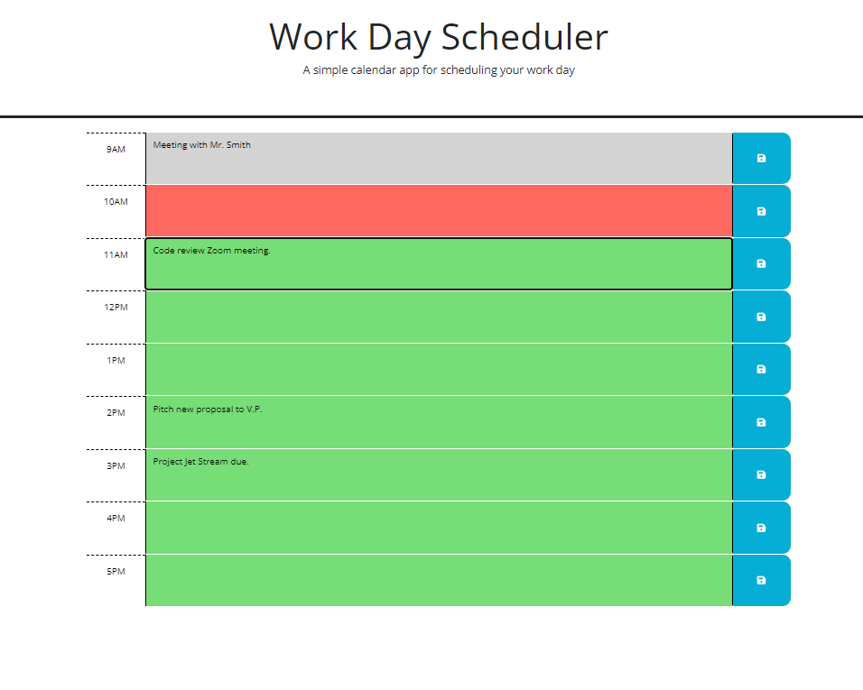

# Work Day Scheduler

## Description

This is Challenge #5, this code creates a simple calendar application that allows a user to save events for each hour of the day by modifying starter code. This app will run in the browser and feature dynamically updated HTML and CSS powered by jQuery.

This library [Day.js](https://day.js.org/en/) is used to work with date and time. Be sure to read the documentation carefully and concentrate on using Day.js in the browser.

 
## Functionality

When the user opens the planner the current day is displayed at the top of the calendar.

When the user scrolls down, the user is presented with time blocks for standard business hours.

When the user views the time blocks for that day, each time block is color coded to indicate whether it is in the past, present, or future.

When the user enters an event and clicks the save button for that time block, the text for that event is saved in local storage.

When the user refreshes the page, the saved events persist.

## Appearance and Location

the following animation demonstrates the application functionality:

The following image is a screenshot of the application:

URL: https://github.com/dawn-kline-m/Work-Day-Scheduler.git

## Project Status

The project is nearing completion.